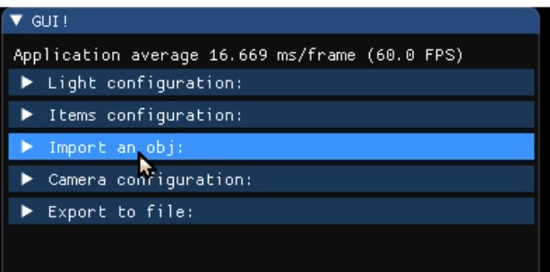
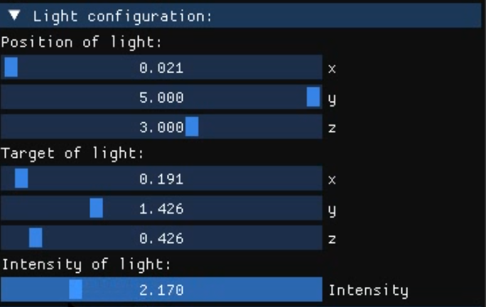
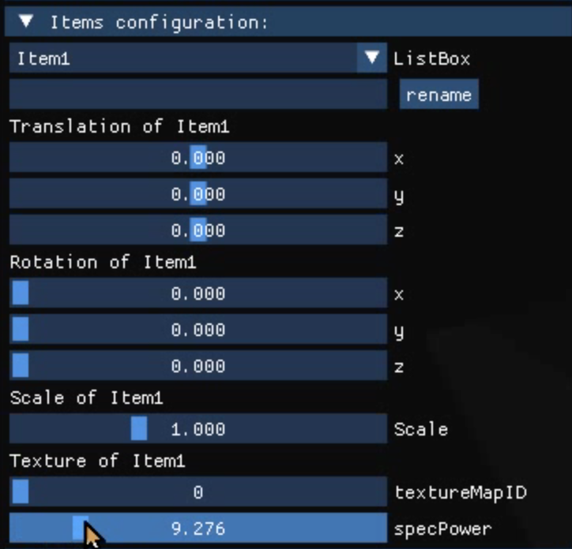
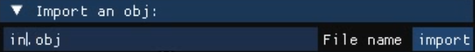
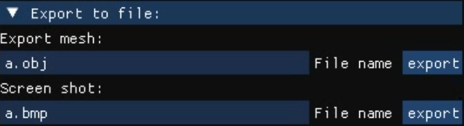

# 计算机图形学实验报告

## 实现功能


##交互说明

本实验使用了IMGUI这一GUI工具实现了交互。

在最上方显示了当前的帧刷新频率FPS。

然后下面有5个可折叠的单元，分别是调整光照，调整物体，导入obj，调整相机，和导出（导出obj和导出截屏），以下讲分条讲解。



### 调整光照



通过滑块可以控制光源的位置和朝向，同时还可以调整光源的强度。

### 调整物体



首先通过listbox下拉菜单可以选取不同的物体进行编辑。首先可以对物体进行重命名，在文本框中输入新的名称后按下rename按键即可。然后可以对物体进行平移，不同的滑块对应不同的方向上的平移量。还可以对物体进行旋转操作，不同的滑块对应不同的轴向上的旋转量。同时下方的滑块还可以分别对物体进行scale变换，编辑不同的textureMap到物体上，还可以改变specpower（对应不同的材质）。

###导入obj



在输入栏中输入要导入的obj，然后按下import按钮即可导入到场景中，若一个obj中有多个item则导入过来后也是多个item，item的名称也会对应导入到场景中。

###调整相机


相机支持free viewpoint模式，orbit模式，和ZoomToFit。

其中free viewpoint模式通过WSADZC来控制相机位置的上下左右前后的移动（pan），上下左右箭头来控制相机的朝向。然后鼠标滚轮实现zoom in，zoom out。因为在文本输入到时候需要使用wsadzc和上下左右箭头，所以为了避免冲突，在GUI中设置了如果展开导出导入菜单栏，则自动关闭free viewpoint模式，通过这种方式来解决冲突。

orbit模式是绕着场景中心进行orbit，为了避免冲突orbit模式开启后会自动关闭free viewpoint模式。

ZoomToFit按键按下后会将画面缩放到适合的大小，使所有物体显示在屏幕中并且刚好充满屏幕。

###导出



#### 导出obj

输入要导出的文件名后，按下export按键即可导出文件。会将场景中的所有item都导出到obj。导出的obj还支持再导入，并且item的名字也是会跟个再导入回来。

####导出屏幕（截屏）

输入要导出的文件名后，按下export按键即可导出文件。我们的截屏经过了特殊处理，可以将imgui的菜单给隐蔽掉。

## 小组分工

- 王英豪 3180102062：基本体素建模，渲染流程，光照模型和实时阴影绘制，nurbs，三维网格导入和导出，几何变换，光源编辑，纹理渲染
- 朱紫涵 3180102678: IMGUI及其与各个模块之间的交互，纹理编辑，基本几何变换。

## 数据组织

- 场景中的物体以Item类的形式组织，其声明如下

  ```c++
  class Item {
  public:
  	Item();
  	std::string name;
  	Texture* texture;
  	Mesh* mesh;
  	float specPower;
  	glm::mat4 worldMatrix;
  	
  	void draw();
  	void drawDepth();
  	void configurate(ShadePass* shadePass);
  	void configurateDepth(ShadePass* shadePass);
  	void updateWorldMatrix(mat4 tWorldMatrix);
  	std::string toObjFile(int &vertCount,int &texCoordCount, int& normalCount);
  };
  ```

  其中Mesh类包含了物体的建模信息，其大致包含以下内容

  ```c++
  class Mesh {
  	std::string mName;
  	std::vector<vec3> mVertices;
  	std::vector<vec3> mNormals;
  	std::vector<std::vector<vec3>*> mTextureCoordinates;
  	UINT mFaceCount;
  	std::vector<UINT> mIndices;
  
  	VBO mVertexBuffer;
  	IBO mIndexBuffer;
  	VAO mVertexArray;
  	bool indexBufferCached;
  	bool vertexBufferCached;
  	bool hasTexCoord;
  };
  ```

  及相关函数。主要包含了顶点的位置，法线方向，纹理坐标，以及顶点序列等组成一个完整VAO的必要信息。

- Texture类包含了纹理相关信息，大致包括

  ```c++
  class Texture :public GLObject {
  public:
  	int width;
  	int height;
  	ShaderProgram* shader;
  	std::string name;
  	GLenum type;
  	GLint unit;
  };
  ```

  记录了自己的ID，材质类型以及对应的纹理单元

- 光源

  ```c++
  class PointLight {
  public:
  	vec3 position;
  	vec3 color;
  	vec3 target;
  	float strength; //1 for weakest, no upper limit
  private:
  	Texture depthMap;
  	FrameBuffer depthMapFBO;
  };
  ```

  实际上实现点光源需要一个Cube map，代码中的光源实际上是一个射灯光源

  光源定义了位置，方向和光的颜色以及强度，这些参数都会在渲染时传给shader

- 场景

  ```c++
  class Scene {
      Camera* camera;
  	PointLight light;
  	ShadowShadePass shadowShader;
  	ColorShadePass colorShader;
  	std::vector<Item*> items;
  	std::vector<Texture*>Textures;
  	bool fExpObj;
  	std::string meshFilename;
  	int width;
  	int height;
  }
  ```

  包含了渲染场景所必要的信息。场景的绘制实质上就是对每个item的绘制。

## 功能实现说明

### 基本体素建模

采用手写Mesh的方式实现，代码如下：

```c++
Mesh* Mesh::createPrism() {
	std::vector<vec3>* textureCoordinates = new std::vector<vec3>();
	auto* mesh = new Mesh();
	mesh->mTextureCoordinates.push_back(textureCoordinates);
	mesh->mVertices.emplace_back(vec3(0, 0, 0));
	textureCoordinates->emplace_back(vec3(0,0,0));
	mesh->mVertices.emplace_back(vec3(1, 0, 0));
	textureCoordinates->emplace_back(vec3(1, 0, 0));
	mesh->mVertices.emplace_back(vec3(1, 1, 0));
	textureCoordinates->emplace_back(vec3(1, 1, 0));
	for (int i = 0; i < 3; i++) mesh->mNormals.emplace_back((vec3(0, 0, -1)));
	mesh->mVertices.emplace_back(vec3(0, 0, 0));
	textureCoordinates->emplace_back(vec3(0, 0, 0));
	mesh->mVertices.emplace_back(vec3(1, 0, 0));
	textureCoordinates->emplace_back(vec3(1, 0, 0));
	mesh->mVertices.emplace_back(vec3(1, 0, 1));
	textureCoordinates->emplace_back(vec3(1, 1, 0));
	for (int i = 0; i < 3; i++) mesh->mNormals.emplace_back((vec3(0, -1, 0)));
	mesh->mVertices.emplace_back(vec3(1, 0, 0));
	textureCoordinates->emplace_back(vec3(0, 0, 0));
	mesh->mVertices.emplace_back(vec3(1, 1, 0));
	textureCoordinates->emplace_back(vec3(1, 0, 0));
	mesh->mVertices.emplace_back(vec3(1, 0, 1));
	textureCoordinates->emplace_back(vec3(0, 1, 0));
	for (int i = 0; i < 3; i++) mesh->mNormals.emplace_back((vec3(1, 0, 0)));
	mesh->mVertices.emplace_back(vec3(0, 0, 0));
	textureCoordinates->emplace_back(vec3(0, 0, 0));
	mesh->mVertices.emplace_back(vec3(1, 1, 0));
	textureCoordinates->emplace_back(vec3(0, 1, 0));
	mesh->mVertices.emplace_back(vec3(1, 0, 1));
	textureCoordinates->emplace_back(vec3(1, 1, 0));
	for (int i = 0; i < 3; i++) mesh->mNormals.emplace_back(normalize(vec3(-1, 1, 1)));
	for (int i = 0; i < 12; i++) mesh->mIndices.emplace_back(i);
	return mesh;
}
```

###nurbs

采用tinynurbs库对nurbs上的点进行求值与求导，将其转化为三角片元进行渲染，代码如下

```c++
#define calcCord(x,y) (x)*sizeU+(y)
Mesh::Mesh(tinynurbs::RationalSurface3f nurbs, float stepU, float stepV) :mVertices(), mNormals(), mTangents(), mBiNormals(), mTextureCoordinates(), mVertexColors(),
mFaceCount(0), mIndices(), mVertexBuffer(), mIndexBuffer() {
	indexBufferCached = false;
	vertexBufferCached = false;
	int sizeU = 1 / stepU + 1;
	int sizeV = 1 / stepV + 1;
	std::vector<vec3>* textureCoordinates = new std::vector<vec3>();
	for (int i = 0; i < sizeU; i++) {
		for (int j = 0; j < sizeV; j++) {
			mVertices.push_back(tinynurbs::surfacePoint(nurbs, i * stepU, j * stepV));
			vec3 p = tinynurbs::surfacePoint(nurbs, i * stepU, j * stepV);
			mNormals.push_back(-tinynurbs::surfaceNormal(nurbs, i * stepU, j * stepV));
			textureCoordinates->push_back(vec3(i * stepU, j * stepV, 0));
		}
	}
	mTextureCoordinates.push_back(textureCoordinates);
	for (int i = 0; i < sizeU - 1; i++) {
		for (int j = 0; j < sizeV - 1; j++) {
			mIndices.push_back(calcCord(i, j));
			mIndices.push_back(calcCord(i + 1, j));
			mIndices.push_back(calcCord(i + 1, j + 1));
			mIndices.push_back(calcCord(i + 1, j + 1));
			mIndices.push_back(calcCord(i, j + 1));
			mIndices.push_back(calcCord(i, j));
		}
	}
}
```

###三维网格导入和导出

导入时为了解决多边形三角剖分和法线生成问题，使用assimp库导入

```c++
std::vector<Item*> Model::loadModel(const std::string& filename, bool flipUVs){
	Assimp::Importer importer;

	UINT flags;

	flags = aiProcess_Triangulate | aiProcess_ValidateDataStructure | aiProcess_FixInfacingNormals | aiProcess_GenNormals | aiProcess_GenUVCoords;

	if (flipUVs) {
		flags |= aiProcess_FlipUVs;
	}

	const aiScene* scene = importer.ReadFile(filename, flags);
	std::vector<Item*> data;
	if (scene->HasMeshes()) {
		for (UINT i = 0; i < scene->mNumMeshes; i++) {
			Mesh* mesh;
			mesh = new Mesh(*(scene->mMeshes[i]));
			auto item = new Item();
			item->mesh = mesh;
			item->name = mesh->Name();
			data.emplace_back(item);
		}
	}
	return data;
}
```

导出则是自主实现，直接将物体顶点，法线，纹理坐标，面信息写入字符串

```c++
std::string Item::toObjFile(int& vertCount, int& texCoordCount, int& normalCount) {
	std::string s = "o " + name + "\n";
	auto& vertices = mesh->Vertices();
	auto& normals = mesh->Normals();
	auto& tex = mesh->TextureCoordinates();
	auto& indices = mesh->Indices();
	bool hasTexCoord = !tex.empty();
	bool hasIndices = !indices.empty();
	for (int i = 0; i < vertices.size(); i++) {
		vec4 v = worldMatrix * vec4(vertices[i], 1);
		v = v / v.w;
		s += "v " + std::to_string(v.x) + " " + std::to_string(v.y) + " " + std::to_string(v.z) + "\n";
	}
	if (hasTexCoord) {
		auto texCoords = tex[0];
		for (int i = 0; i < texCoords->size(); i++) {
			s += "vt " + std::to_string(texCoords->at(i).x) + " " + std::to_string(texCoords->at(i).y) + "\n";
		}
	}
	for (int i = 0; i < normals.size(); i++) {
		vec4 n = worldMatrix * vec4(normals[i], 0);
		s += "vn " + std::to_string(n.x) + " " + std::to_string(n.y) + " " + std::to_string(n.z) + "\n";
	}
	if (hasIndices) {
		for (int i = 0; i < indices.size(); i += 3) {
			s += "f";
			for (int j = 0; j < 3; j++) {
				s += " ";
				s += std::to_string(indices[i + j] + vertCount);
				s += "/";
				if (hasTexCoord) s += std::to_string(indices[i + j] + texCoordCount);
				s += "/";
				s += std::to_string(indices[i + j] + normalCount);
			}
			s += "\n";
		}
	}
	s += "\n";
	vertCount += vertices.size();
	normalCount += normals.size();
	if (hasTexCoord) texCoordCount += tex[0]->size();
	return s;
}
```

###基本几何变换

使用一个4x4的矩阵描述每个物体的变化，并传入shader

```c++
glm::mat4 worldMatrix;
```

GUI得到滑块传来的平移，旋转，缩放信息，然后对应矩阵相乘即可得到worldMatrix，然后通过render，scene更新到对应Item中。

```c++
static mat4 NewWorldMatrix= glm::identity<mat4>();
static mat4 TransMatrix = glm::identity<mat4>();
static mat4 RotateMatrix = glm::identity<mat4>();
TransMatrix= glm::translate(glm::mat4(1.0f), glm::vec3(translate[selectedItem][0], translate[selectedItem][1], translate[selectedItem][2]));
RotateMatrix= glm::rotate(TransMatrix, glm::radians(rotation[selectedItem][0]), glm::vec3(1.0f, 0.0f, 0.0f));
RotateMatrix= glm::rotate(RotateMatrix, glm::radians(rotation[selectedItem][1]), glm::vec3(0.0f, 1.0f, 0.0f));
RotateMatrix= glm::rotate(RotateMatrix, glm::radians(rotation[selectedItem][2]), glm::vec3(0.0f, 0.0f, 1.0f));
NewWorldMatrix = glm::scale(RotateMatrix, glm::vec3(Scale[selectedItem], Scale[selectedItem], Scale[selectedItem]));
render->updateItemWorldMatrix(selectedItem, NewWorldMatrix);
```

###材质、纹理显示和编辑

####	纹理渲染

使用SOIL从图片中读取信息，保存为texture并传入shader

```c++
Texture::Texture(ShaderProgram* shader, const char* path, const std::string& name, GLint unit) {
	glGenTextures(1, &id);
	initialize(shader, name, unit);
	unsigned char* image = SOIL_load_image(path, &this->width, &this->height, 0, SOIL_LOAD_RGB);
	glBindTexture(GL_TEXTURE_2D, id);
	glPixelStorei(GL_UNPACK_ALIGNMENT, 1);
	glTexImage2D(GL_TEXTURE_2D, 0, GL_RGB, width, height, 0, GL_RGB, GL_UNSIGNED_BYTE, image);
	glGenerateMipmap(GL_TEXTURE_2D);
	SOIL_free_image_data(image);
	glBindTexture(GL_TEXTURE_2D, 0);
}
```

#### 	纹理编辑

首先我们预先加载41张图片到texture的vector中，然后根据GUI所指定的每一个item的textureMapID，将item的texture指针指向对应的texture。

```c++
//texture preload
Textures.clear();
Texture* newtex = new Texture(colorShader.GetShader(), "asset/floor.jpg", "colorTexture", 0);
Textures.push_back(newtex);
for (int i = 1; i <= 40; i++) {
	static std::string filename;
	std::string tmp = num2str(i);
	if (tmp.length() == 1) tmp = "0" + tmp;
	filename = "asset/nasa/nasa" + tmp + ".jpg";
	std::cout << filename << std::endl;
	Texture * newtex=new Texture(colorShader.GetShader(), filename.c_str(), "colorTexture", 0);
	Textures.push_back(newtex);
}
```

#### 	材质编辑（specpower）

每一个Item对应一个specpower，在渲染时候传给shader

```c++
*(*shadePass)[std::string("specPower")] << specPower;
```

用户在GUI中更新物体的specpower后，GUI通过render，scene更新到对应Item中。

###光源编辑

IMGUI调整上述光源信息中的各项参数，通过render和scene传入shader

```c++
render->updateLight(vec3(lightPos[0], lightPos[1], lightPos[2]), vec3(lightTarget[0], lightTarget[1], lightTarget[2]), lightIntensity);
```

###渲染流程

使用可编程渲染管线进行绘制，分为两步，第一次渲染得到光源空间深度信息，第二次渲染得到最终图像。

```c++
void MainScene::draw() {
	shadowShader.GetShader()->bind();
	shadowShader.configurate();
	light.configurateDepth(&shadowShader);
	for (auto item : items) {
		item->configurateDepth(&shadowShader);
		item->drawDepth();
	}
	glBindFramebuffer(GL_FRAMEBUFFER, 0);
	glViewport(0, 0, width, height);
	glClear(GL_COLOR_BUFFER_BIT | GL_DEPTH_BUFFER_BIT);
	colorShader.GetShader()->bind();
	colorShader.configurate();
	light.configurate(&colorShader);
	for (auto item : items) {
		item->configurate(&colorShader);
		item->draw();
	}
}
```

###光照模型

采用phong光照模型，具体代码如下

```glsl
vec3 calcPhongColor(){
	vec3 lightVec = lightPos - IN.WorldPos.xyz;
	vec3 viewVec = cameraPos - IN.WorldPos.xyz;
	float strength = min(1,lightStrength/length(lightVec));///length(lightVec);
	lightVec = normalize(lightVec);
	viewVec = normalize(viewVec);
	vec3 reflectVec = reflect(-lightVec, IN.WorldNormal);
	vec4 texColor = IN.TextureCoordinate.x >= 0 ? texture2D(colorTexture, IN.TextureCoordinate) : vec4(0.7,0.7,0.7,0.7);
	vec4 specColor = texColor * vec4(lightColor, 1) * strength * pow(max(0,dot(reflectVec,viewVec)),specPower);
	vec4 diffuseColor = texColor * vec4(lightColor, 1) * strength * max(0,dot(lightVec,IN.WorldNormal));
	return vec3(specColor+diffuseColor);
}
vec3 calcAmbientColor(){
	vec4 texColor = texture2D(colorTexture, IN.TextureCoordinate);
	vec4 ambientColor = texColor * ambientPower;
	return vec3(ambientColor);
}
```

###实时阴影

采用shadow map实现，第一次渲染得到深度信息

```glsl
#version 440 core

layout (location = 0) in vec4 ObjectPosition;

uniform mat4 lightSpaceMatrix;
uniform mat4 worldMatrix;

void main(){
    vec4 pos = lightSpaceMatrix * worldMatrix * ObjectPosition;
    gl_Position = pos;
}
```

第二次渲染时检测是否被阻挡

```glsl
float calcShadow(){
    vec3 projCoords = IN.FragPosLightSpace.xyz/IN.FragPosLightSpace.w;
    projCoords = projCoords * 0.5 + vec3(0.5,0.5,0.5);
	if(projCoords.x>1||projCoords.x<0) return 0.0;
	if(projCoords.y>1||projCoords.y<0) return 0.0;
	if(projCoords.z > 1.0) return 0.0;//No shadow
    float closestDepth = texture(shadowMap, projCoords.xy).r; 
    float currentDepth = projCoords.z;
	float bias = 0.005;
    float shadow = currentDepth - bias > closestDepth ? 0.0 : 1.0;
    return shadow;
}
```

## 附录

- 第二次渲染的详细shader代码

  vertex shader

  ```glsl
  #version 440 core
  #define MAX_LIGHT_COUNT
  
  layout (location = 0) in vec4 ObjectPosition;
  layout (location = 1) in vec2 TextureCoordinate;
  layout (location = 2) in vec3 Normal;
  
  layout (location = 0) uniform mat4 viewProjectionMatrix;
  layout (location = 1) uniform mat4 worldMatrix;
  
  layout (location = 2) uniform mat4 lightSpaceMatrix;
  
  /************* Data Structures *************/
  
  layout(location = 0) out VS_OUTPUT {
  	vec4 Position;
  	vec4 WorldPos;
  	vec2 TextureCoordinate;
  	vec3 WorldNormal;
  	vec4 FragPosLightSpace;
  }OUT;
  
  /************* Vertex Shader *************/
  void main() {
  	OUT.Position = viewProjectionMatrix * worldMatrix * vec4(ObjectPosition.xyz, 1);
  	OUT.WorldPos = worldMatrix * vec4(ObjectPosition.xyz, 1);
  	OUT.TextureCoordinate = vec2(TextureCoordinate.x, TextureCoordinate.y);
  	OUT.WorldNormal = normalize((worldMatrix * vec4(Normal, 0)).xyz);
  	OUT.FragPosLightSpace = lightSpaceMatrix * OUT.WorldPos;
  	gl_Position = OUT.Position;
  }
  
  ```

  fragment shader

  ```glsl
  #version 440 core
  #define PI 3.14159265f
  
  layout(location = 0) in VS_OUTPUT {
  	vec4 Position;
  	vec4 WorldPos;
  	vec2 TextureCoordinate;
  	vec3 WorldNormal;
  	vec4 FragPosLightSpace;
  }IN;
  
  layout(location = 0) out vec4 finalColor;
  
  layout (location = 2) uniform mat4 lightSpaceMatrix;
  layout (location = 3) uniform vec3 lightPos;
  layout (location = 4) uniform vec3 lightColor;
  layout (location = 5) uniform float lightStrength;
  layout (location = 6) uniform vec3 cameraPos;
  layout (location = 7) uniform float specPower;
  layout (location = 8) uniform float ambientPower;
  
  layout (location = 9) uniform sampler2D colorTexture;
  layout (location = 10) uniform sampler2D shadowMap;
  
  /************* Pixel Shader *************/
  float calcShadow(){
      vec3 projCoords = IN.FragPosLightSpace.xyz/IN.FragPosLightSpace.w;
      projCoords = projCoords * 0.5 + vec3(0.5,0.5,0.5);
  	if(projCoords.x>1||projCoords.x<0) return 0.0;
  	if(projCoords.y>1||projCoords.y<0) return 0.0;
  	if(projCoords.z > 1.0) return 0.0;//No shadow
      float closestDepth = texture(shadowMap, projCoords.xy).r; 
      float currentDepth = projCoords.z;
  	float bias = 0.005;
      float shadow = currentDepth - bias > closestDepth ? 0.0 : 1.0;
      return shadow;
  }
  vec3 calcPhongColor(){
  	vec3 lightVec = lightPos - IN.WorldPos.xyz;
  	vec3 viewVec = cameraPos - IN.WorldPos.xyz;
  	float strength = min(1,lightStrength/length(lightVec));///length(lightVec);
  	lightVec = normalize(lightVec);
  	viewVec = normalize(viewVec);
  	vec3 reflectVec = reflect(-lightVec, IN.WorldNormal);
  	vec4 texColor = IN.TextureCoordinate.x >= 0 ? texture2D(colorTexture, IN.TextureCoordinate) : vec4(0.7,0.7,0.7,0.7);
  	vec4 specColor = texColor * vec4(lightColor, 1) * strength * pow(max(0,dot(reflectVec,viewVec)),specPower);
  	vec4 diffuseColor = texColor * vec4(lightColor, 1) * strength * max(0,dot(lightVec,IN.WorldNormal));
  	return vec3(specColor+diffuseColor);
  }
  vec3 calcAmbientColor(){
  	vec4 texColor = texture2D(colorTexture, IN.TextureCoordinate);
  	vec4 ambientColor = texColor * ambientPower;
  	return vec3(ambientColor);
  }
  void main(){
  	vec3 color = calcAmbientColor();
  	color += calcShadow()*calcPhongColor();
      finalColor = vec4(color,1);
  }
  
  ```

  

